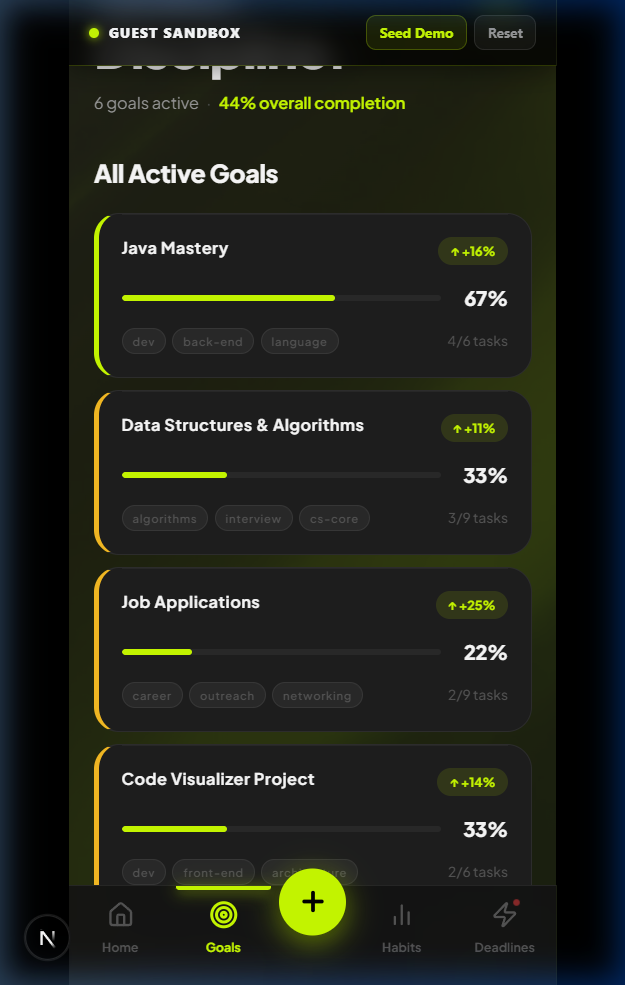
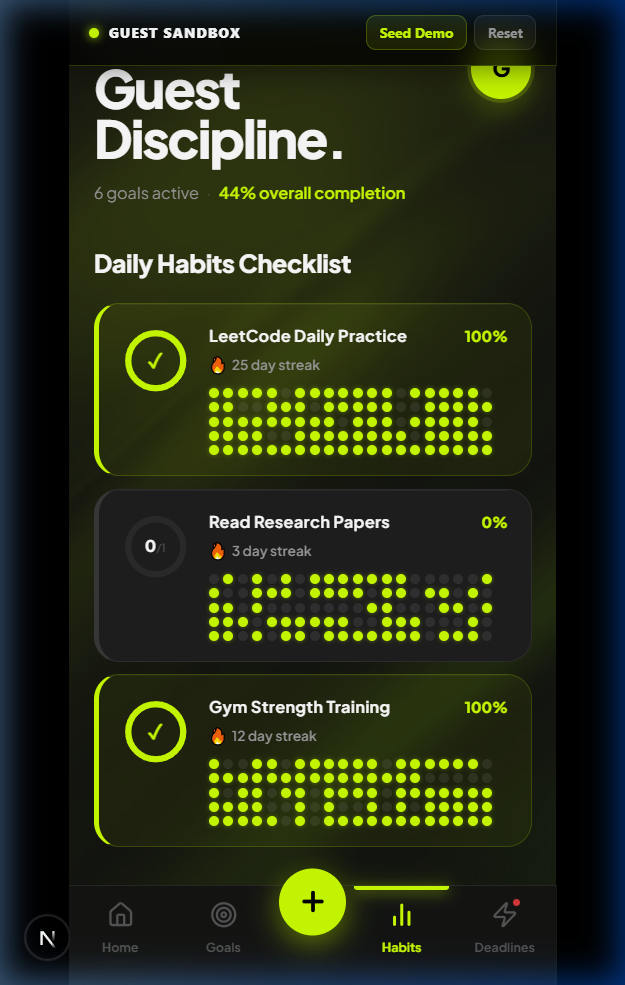
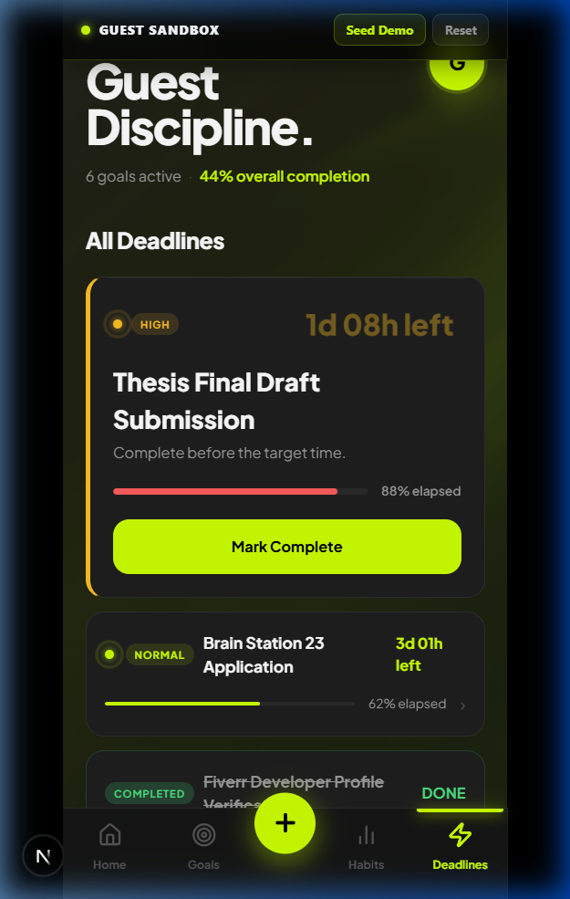

# Aether Goals

A dark, minimalist mobile-first PWA for disciplined people. Track long-term goals broken into subtasks, build daily habits with streak accountability, and manage deadlines with live countdowns — all from a single focused dashboard. Ships as an installable PWA and compiles to a native Android APK via Capacitor.

> Try it instantly — no account required: `http://localhost:3000/guest`

---

## Preview

<div align="center">
  <table>
    <tr>
      <td align="center"><strong>Dashboard</strong></td>
      <td align="center"><strong>Goals</strong></td>
      <td align="center"><strong>Habits</strong></td>
      <td align="center"><strong>Deadlines</strong></td>
    </tr>
    <tr>
      <td></td>
      <td></td>
      <td></td>
      <td></td>
    </tr>
  </table>
</div>

---

## Core Features

### → Goals & Subtask Checklists

Goals are the primary unit of progress in Aether. Each goal holds an ordered list of subtasks that you define. As you complete subtasks, the goal card updates in real time with:

- An **animated progress bar** that springs into position on load
- A **completion ratio** (`3 of 6 tasks`)
- A **delta badge** tracking weekly momentum (`↑ +14% this week`)
- **Color-coded left borders** — lime when progress is above 60%, yellow for in-progress, grey for unstarted

Tapping a goal opens a **spring bottom-sheet detail drawer** with the full subtask list, edit controls, and a completion timeline. Goals support arbitrary comma-separated tags shown as pill labels on each card.

The **Bento Hero Card** on the dashboard shows your top goal in a large lime-accent card with a 72px animated progress percentage, a decorative animated dot grid, dual counter-rotating ring decorations, and a wave SVG at the base. The count-up animation uses a custom `useCountUp` hook with a spring easing curve.

---

### → Daily Habit Streaks with 100-Day Grid

Habits are daily recurring check-ins with configurable targets (e.g. "do 3 sets = daily target of 3"). The check-in model is tap-to-increment: each tap adds one completion, and once the daily target is reached the ring turns complete. Tapping again resets back to 0 (undo).

Each habit card renders:

- A **circular SVG progress ring** with `stroke-dashoffset` animation driven by a spring transition
- A **live streak counter** (consecutive days meeting the daily target, counting backwards from today)
- A **100-day activity grid** — a 5 × 20 matrix of circular dot indicators (8px each, 3.5px gap) where lime dots represent days you hit target, grey dots represent misses. Identical in concept to GitHub's contribution graph.

Tapping a habit card opens the detail drawer which shows:

- A larger radial ring with today's completions / target in the centre
- A **month calendar view** (`HabitCalendar`) with day cells colored as `complete` (full lime), `partial` (dimmed lime), `empty` (grey), or `future` (faded) — computed from the full log history
- Live completion rate, streak count, and per-day check-in count
- A full-width "Complete Daily Check-in" button that becomes "Already Checked In (Undo)" when complete

The streak algorithm walks backwards from today in a `for` loop up to 365 days, stopping at the first day with fewer completions than the daily target. If today is already complete, it starts from today; otherwise starts from yesterday.

---

### → Deadlines with Live Countdown

Deadlines are time-boxed commitments with a due date and a completion toggle. The **Featured Deadline** card (always the closest active one) shows:

- A large **live countdown timer** (`14h 23m left`) displayed at 28px/900 weight, updated every second via `useCountdown`
- A **pulsing radar dot** beside the priority badge — three animated rings expand outward and fade using `bentoRadarPulse` keyframes. The dot color matches the priority: red for CRITICAL/OVERDUE, yellow for HIGH, lime for NORMAL
- An **elapsed time progress bar** that fills red as the deadline approaches — computed as `(1 - remainingMs / totalDurationMs) * 100`
- A **"Mark Complete" CTA button** that switches to a lime-outlined "Completed" state when toggled

Secondary deadlines appear as `DeadlineListItem` rows with a thinner 3px progress bar, a compact priority badge, and a countdown on the right.

Priority is computed by a `mapDeadlineProps` utility:
- `OVERDUE` — past due date
- `CRITICAL` — less than 24h remaining
- `HIGH` — less than 72h remaining
- `NORMAL` — anything further out

---

### → Natural Language Date Parsing

The deadline creation form accepts plain English in a dedicated NLP input field, powered by `chrono-node`. The parser runs on every keystroke via a `useEffect` and updates the hidden `datetime-local` field in real time.

Supported expressions:
- `"tomorrow"` → defaults to 11:59 PM of the next day
- `"next Friday"` → Friday at 11:59 PM
- `"June 15th at 3pm"` → June 15 at 15:00
- `"in 3 days"` → 72 hours from now at 11:59 PM

The time defaulting logic checks `result.start.isCertain("hour")` — if the parsed result does not have a certain hour component, the system forces `23:59:00`. Custom times are fully respected.

---

### → Bento Dashboard with Live Stats

The home tab renders a curated overview rather than a list. Below the top-goal hero card, a 3-card bento grid shows:

| Card | Contents |
|---|---|
| **Streak** | Largest current habit streak. Animated SVG flame icon (3-layer flicker: outer glow, inner active, core white spark). Count-up number animation. |
| **Completion** | Overall goal progress across all goals, averaged. Renders a 56px SVG progress ring + animated percentage counter. |
| **Habits Today** | `x / y` habits checked in today. Segmented bar of slots — each slot fills lime with a glow as habits are completed, with staggered CSS transitions per slot. |

Below the bento, the home tab renders the single best-performing goal, up to two curated habits (the most active and the most-lagging), and the closest deadline.

---

### → Spring Bottom Sheet Drawers

All modals (detail view, add/edit item, settings) use a custom `SpringDrawer` component built with `createPortal`. Key implementation details:

- **Physics drag**: `useSpringDrawerDrag` tracks pointer/touch events on the sheet and applies `translate3d` transforms directly to the DOM node during drag, bypassing React's rendering cycle for 60fps performance. Dismissal triggers if drag distance exceeds `closeThreshold` (default 100px) or if release velocity exceeds `velocityThreshold` (default 0.55px/ms)
- **Backdrop**: `backdrop-filter: blur(12px)` frosted glass overlay at 78% opacity black
- **Sheet surface**: `backdrop-filter: blur(24px)` on the sheet itself, with a 1.5px top border at 55% white opacity creating a glass edge highlight
- **Scroll conflict resolution**: The inner content area has `touchAction: "pan-y"` to allow native vertical scrolling; the outer container has `touchAction: "none"` to intercept horizontal/directional drags for dismiss
- **Keyboard accessibility**: Escape key closes the drawer; focus is trapped inside and restored to the trigger element on close; ARIA `role="dialog"` and `aria-modal="true"` applied

---

### → 3-Phase Onboarding Guide

On first use (when any of goals/deadlines/habits is zero), a guided onboarding card appears at the top of the home tab. It progresses through three phases:

- **Phase 1** — No goals exist → prompt to create first goal (lime accent)
- **Phase 2** — Goals exist but no deadlines → prompt to set a deadline (yellow accent)
- **Phase 3** — Goals + deadlines exist but no habits → prompt to start a habit (lime accent)

The card shows the phase title, description, an icon, a CTA button, and 3 segmented pill indicators (filled lime for active/completed, grey for incomplete). The entire guide disappears once all three have at least one item.

---

### → Glassmorphic Toast Notifications

`ToastProvider` exposes a `useToast()` hook throughout the app. Toasts render fixed at the top of the screen with:

- `backdrop-filter: blur(16px)` frosted glass surface
- Status-coded left border and ambient glow: lime for success/default, red for error, white for info
- Slide-down + scale-in entry animation (`toastIn` keyframes)
- 3-second auto-dismiss with a fade-out transition

---

### → Pull-to-Refresh & PWA Install

`PullToRefresh` is a global component mounted at root layout level. It listens to `touchstart` / `touchmove` / `touchend` events on the document, tracks scroll position and drag velocity, and calls `window.location.reload()` when a threshold downward drag is released at the top of the page.

PWA install capture: `layout.tsx` inlines a script before app hydration that captures the `beforeinstallprompt` event on `window.deferredPrompt`, preventing the browser default. Components can read and invoke this saved event to trigger the native install prompt at the right moment.

---

### → Guest Sandbox Mode (`/guest`)

The entire app runs locally with no server or account:

- The `StoreProvider` is initialized with `guestMode={true}`, which hard-codes a `guest-id` user object and bypasses all Supabase calls
- All mutations (add, update, delete, toggle) operate only on React state
- Three `useEffect` hooks (in `store.tsx`, `habitStore.tsx`, `deadlineStore.tsx`) write the latest state to `localStorage` keyed as `guest_goals`, `guest_habits`, `guest_habit_logs`, `guest_deadlines` — but only after `loading = false` to prevent clobbering pre-seeded data on mount
- The floating banner exposes two actions: **Seed Demo** (calls `getInitialSeedData()` and writes realistic goals, habits with 100-day generated logs, and deadline entries directly to `localStorage` before reloading) and **Reset** (clears `localStorage` and reloads)

---

### → Supabase Cloud Sync

For persistent multi-device sync, connect a Supabase project. The data model:

| Table | Description |
|---|---|
| `goals` | Goal records with title, tags, sort_order |
| `subtasks` | Linked subtasks with is_complete, sort_order |
| `habits` | Habit records with daily_target, tags (icon serialized as `icon:name` tag) |
| `habit_logs` | Per-day completion log: `(habit_id, log_date)` unique, stores completions count |
| `deadlines` | Deadline records with due_date (ISO), completed flag |
| `profiles` | User display name / username linked to `auth.users` |

All tables enforce Row Level Security. Goal reordering uses a dedicated `update_goal_with_subtasks` Postgres RPC function to atomically update title, tags, sort order, and subtask diffs in a single round trip.

---

## Architecture

```
src/
  app/
    guest/          # Guest sandbox page (no auth required)
    layout.tsx      # Root layout — PWA manifest, pull-to-refresh, service worker
    page.tsx        # Root page — Supabase config check / auth gate
  features/
    dashboard/      # Main dashboard shell, bento grid, drawers, bottom nav
    goals/          # GoalCard component
    habits/         # HabitCard component
    deadlines/      # DeadlineCard (featured + list item), countdown hook
    items/          # Unified add/edit sheet + useAddItemForm hook (goals/habits/deadlines)
    settings/       # SettingsSheet — profile edit, password change, config status
    ui/             # SpringDrawer + useSpringDrawerDrag physics hook
    sandbox/        # AnimatedNetworkGraph, background canvas animations
  lib/
    store.tsx       # Goals context + CRUD + localStorage guest sync
    habitStore.tsx  # Habits context + CRUD + streak computation
    deadlineStore.tsx # Deadlines context + CRUD
    seed.ts         # Static demo dataset (goals + subtasks)
    types.ts        # Shared TypeScript interfaces
    supabase.ts     # Supabase client singleton
  components/
    LoadingScreen.tsx
    ParallaxCard.tsx   # 3D tilt card with mouse/touch parallax transform
    PullToRefresh.tsx
    ServiceWorkerRegister.tsx
```

---

## Stack

| | |
|---|---|
| Framework | Next.js 15 — App Router, server components, static export |
| Language | TypeScript (strict) |
| Styling | Tailwind CSS utility classes + inline CSS custom properties (`--ac`, `--bg`, `--card`, `--t1/2/3`, `--b1/2`) |
| Fonts | Geist Sans + Geist Mono (local variable fonts via `next/font/local`). Plus Jakarta Sans loaded via Google Fonts inside the dashboard component |
| Database | Supabase — PostgreSQL with Row Level Security |
| Auth | Supabase Auth — email/password, session persistence, profile metadata |
| NLP | `chrono-node` v2 — natural language date/time parsing |
| PWA | `manifest.json` + Service Worker shell caching (`public/sw.js`) |
| Native | Capacitor CLI — Next.js static export → Android Gradle project |
| Icons | `lucide-react` |

---

## Design Tokens

All visual decisions resolve to a small set of CSS custom properties declared in `DashboardContent.tsx`:

```css
--bg:       #141414   /* Page background */
--card:     #1e1e1e   /* Card surface */
--card-2:   #252525   /* Elevated card */
--card-3:   #2a2a2a   /* Input / inner surface */
--ac:       #ccff00   /* Primary accent — lime */
--ac-soft:  rgba(204,255,0,0.12)
--ac-mid:   rgba(204,255,0,0.35)
--t1:       #ffffff   /* Primary text */
--t2:       #9a9a9a   /* Secondary text */
--t3:       #555555   /* Tertiary / label text */
--b1:       rgba(255,255,255,0.07)   /* Subtle border */
--b2:       rgba(255,255,255,0.13)   /* Active border */
--danger:   #ff5c5c
--ok:       #4ade80
--warn:     #fbbf24
```

---

## Local Setup

### 1. Clone & Install
```bash
git clone https://github.com/Hasinish/Aether-Goals.git
cd Aether-Goals
npm install
```

### 2. Environment Variables
Create `.env.local` in the project root:
```env
NEXT_PUBLIC_SUPABASE_URL=https://your-project-id.supabase.co
NEXT_PUBLIC_SUPABASE_ANON_KEY=your-anon-key
```
Without these, the app renders a setup prompt. Skip directly to `/guest` to use the app with no config at all.

### 3. Database Schema
Run the migration in your Supabase SQL editor:
```
supabase/migrations/001_init_schema.sql
```

To allow instant signups without email verification:
- Supabase Dashboard → Authentication → Providers → Email → toggle **Confirm email** OFF

### 4. Run
```bash
npm run dev
```
Open `http://localhost:3000` or go straight to `http://localhost:3000/guest`.

---

## Android Build

Requires OpenJDK 17 (`JAVA_HOME`) and Android SDK (`ANDROID_HOME`).

```bash
# 1. Export static build
npm run build

# 2. Sync web assets to Capacitor Android project
npx cap sync android

# 3. Build debug APK
cd android
.\gradlew.bat assembleDebug
```

Output: `android/app/build/outputs/apk/debug/app-debug.apk`

---

## License

MIT
